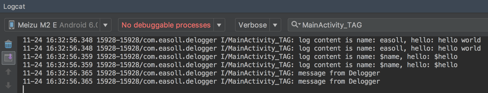
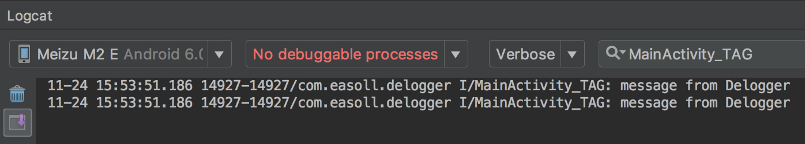

# Delogger
一个用于移除代码中Log语句的android编译插件。
## 效果展示
在使用插件前后，分别有一下日志输出：





## 使用方法
project的build.gradle

```
buildscript {
    repositories {
        maven{
            url "https://dl.bintray.com/easoll/android-plugin"
        }
    }
    dependencies {
        classpath 'com.easoll.plugin:delogger:1.0.3'
    }
}
```

app的build.gradle
```
apply plugin: 'com.easoll.delogger'
```